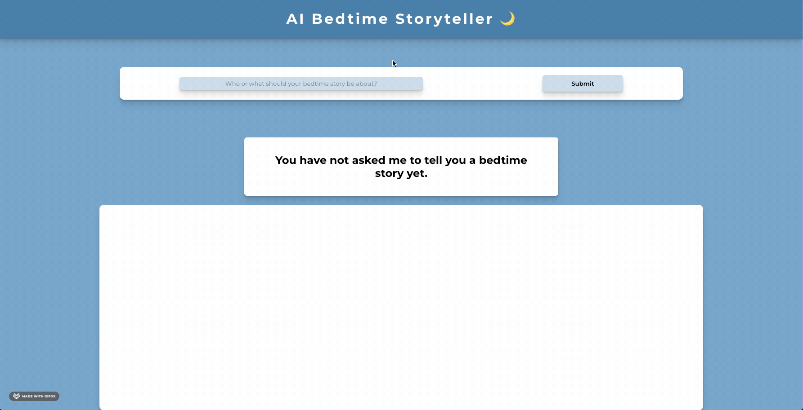

# AI Bedtime Storyteller

## Deployment

Deployment can be found at [this link](https://zwsaile.github.io/shopify-challenge-summer/)

## About

AI Bedtime Storyteller is an application that will generate unique bedtime stories based on user prompts.

This application utilizes the OpenAI API, which is capable of understanding and generating natural language and code. This API can be used for everything from content generation to semantic search and classification.

AI Bedtime Storyteller uses this API to return a generated bedtime story based on the user's prompt. The responses are stored in a list for the user to return to if they wish.


## Author

- [Zachary Saile](https://www.github.com/zwsaile)


## Tech Stack

- **Client -** React, CSS

- **Testing -** Cypress


## Documentation

[OpenAI Documentation](https://beta.openai.com/docs/introduction)


## API Reference

#### POST URL

```http
  POST https://api.openai.com/v1/engines/text-curie-001/completions
```

##### Example Request

```
fetch("https://api.openai.com/v1/engines/text-curie-001/completions", {
  method: 'POST',
  headers: {
    "Content-Type", "application/json");
    "Authorization", `Bearer <API_KEY>`);
  },
  body: JSON.stringify({
    "prompt": `Tell me a 6 sentence bedtime story about <user prompt>`,
    "temperature": 1,
    "max_tokens": 200
  }),
  redirect: 'follow'
}).then(response => response.json())
```

| Parameter | Type     | Description                |
| :-------- | :------- | :------------------------- |
| `API_KEY` | `string` | **Required** Your API key |


## Application In Use




## Running Tests

To run tests, run the following command

```bash
  npm run cypress
```


## Run Locally

Clone the project

```bash
  git clone git@github.com:zwsaile/shopify-challenge-summer.git
```

Go to the project directory

```bash
  cd shopify-challenge-summer
```

Install dependencies

```bash
  npm install
```

Start the server

```bash
  npm run start
```
